# SpeedBoard for GT7
A simple dashboard for Gran Turismo 7. Also includes a graphical lap comparison tool and a playback server.

Based on code from https://github.com/Bornhall/gt7telemetry and https://github.com/snipem/gt7dashboard.

## Apps

### SpeedBoard for GT7

The actual dashboard for racing. 

Features:

- Tyre temperatures
- Fuel consumption and fuel remaining
- Speed and time comparisons to 
    - the previous lap
    - the best lap
    - the median lap
    - up to three pre-loaded reference laps
- Brake/throttle points (optionaly with countdown)
- Racing line comparisons
- Session statistics
- Track detection
- Special mode for Circuit Experiences
- Record data to a file
- Save the best, last or all laps to a file
- The location-based markers

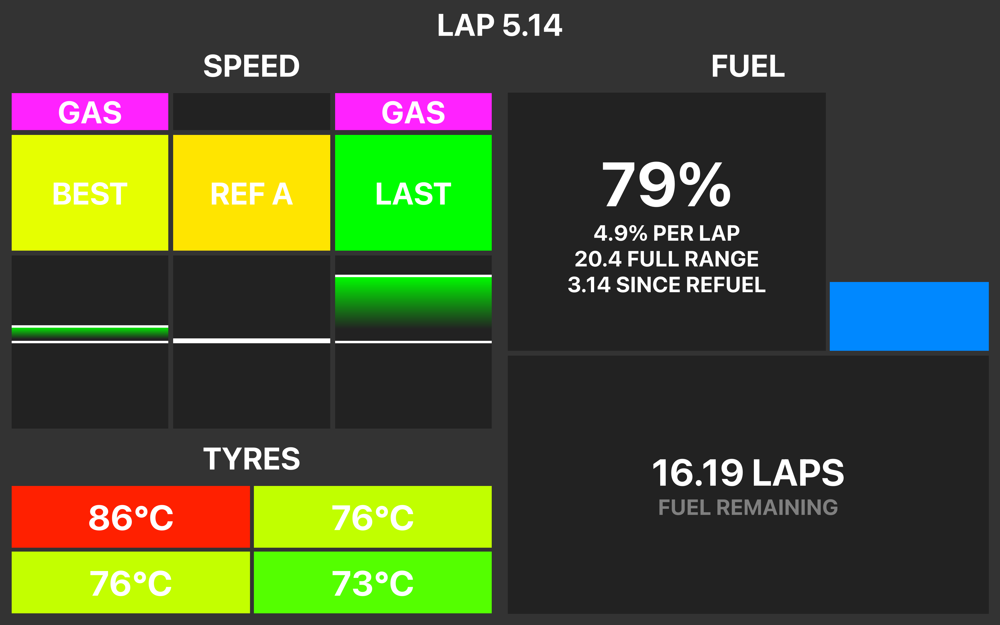
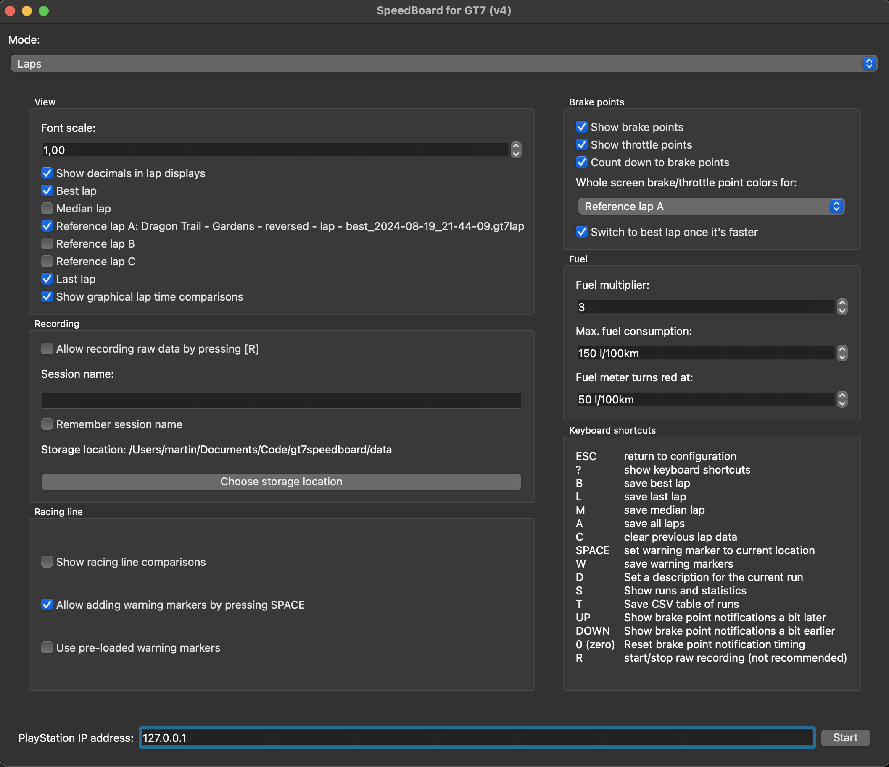
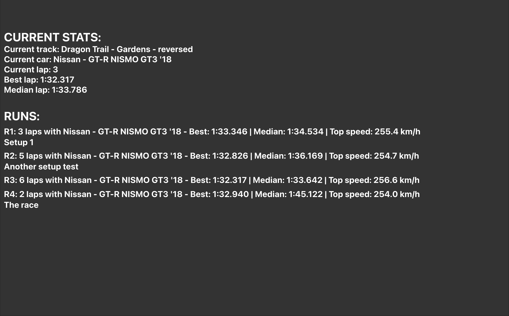
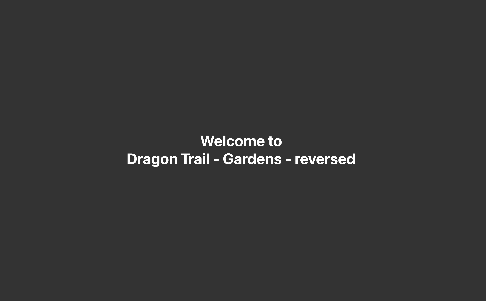

### gt7playbackserver

Can act as a virtual PlayStation running GT7 to serve pre-recorded telemetry data to any app that can receive it. Use 127.0.0.1 as the PlayStation IP address to connect to the playback server.

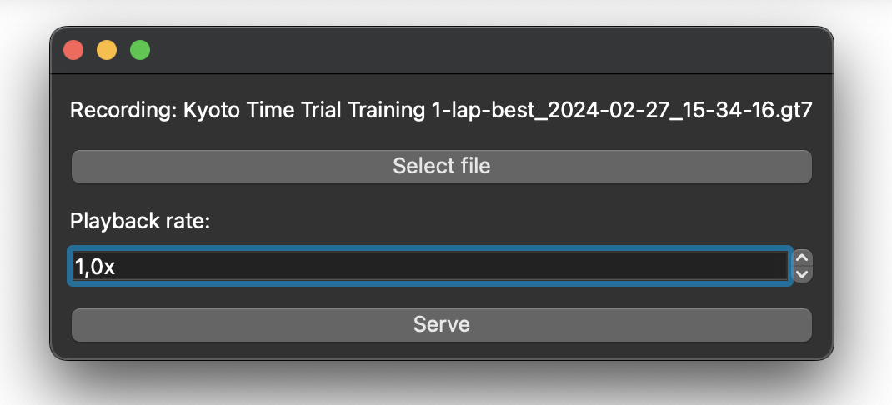

### graphicallapcomparison

Load two pre-recorded laps and compare them in a visual way.

- Racing lines
- Brake points
- Speed
- Throttle
- Time gains/losses
- Gears

Drag the track around with the mouse and use the mouse wheel to zoom. Keyboard shortcuts to show or hide elements are listed in the top right corner.

#### Racing line
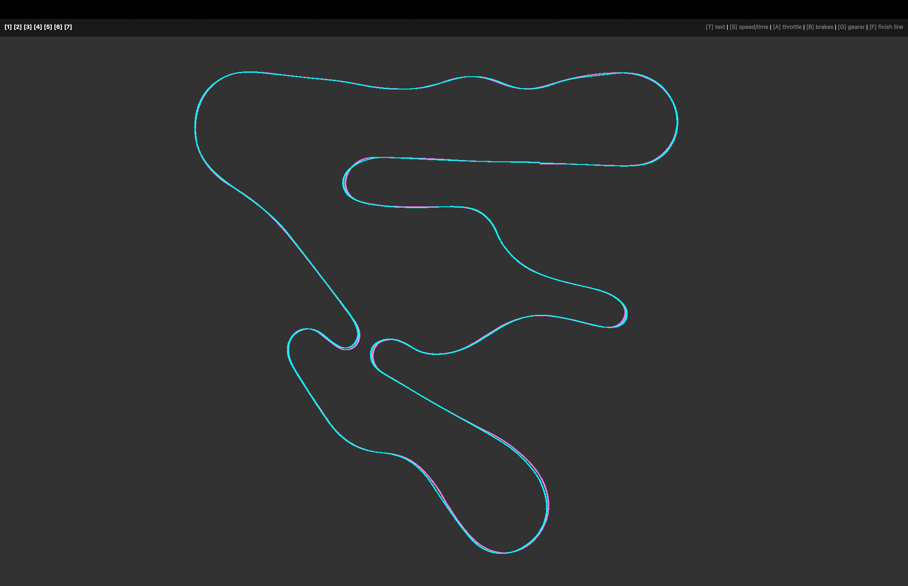
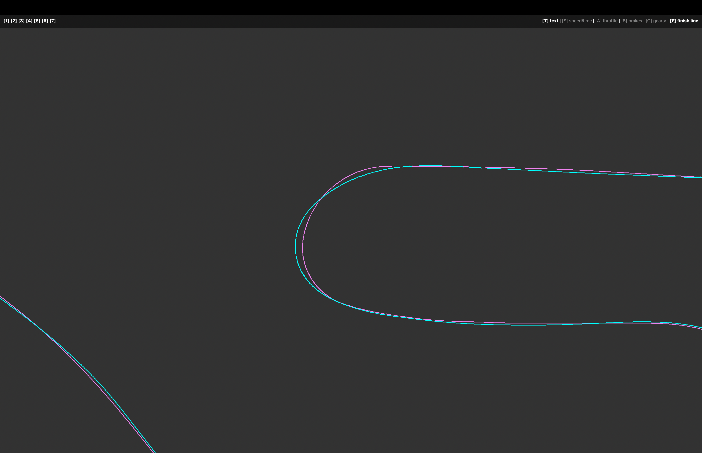
#### Brake points
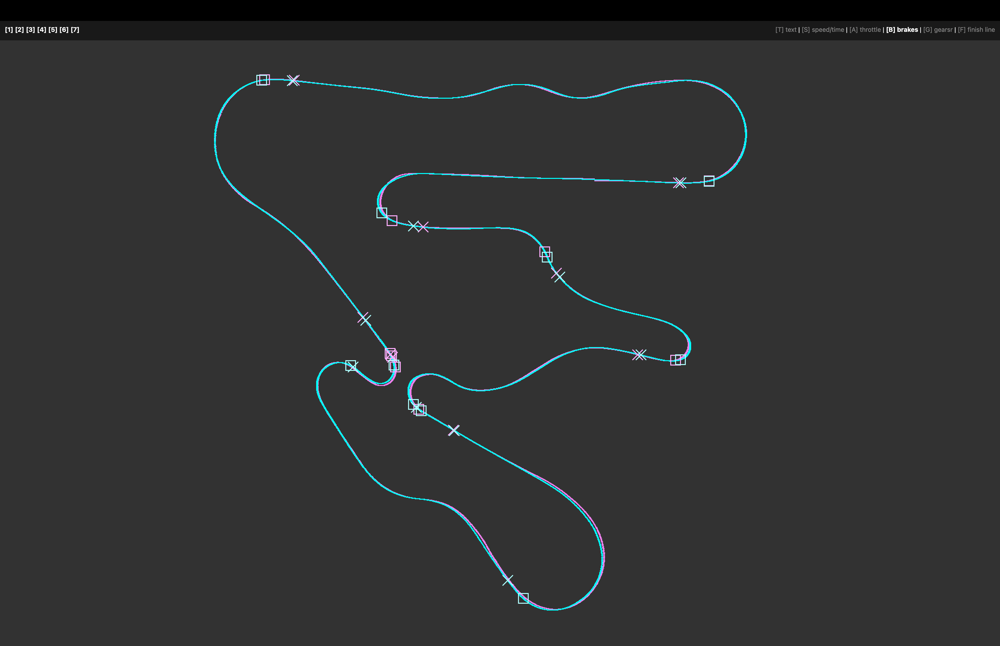
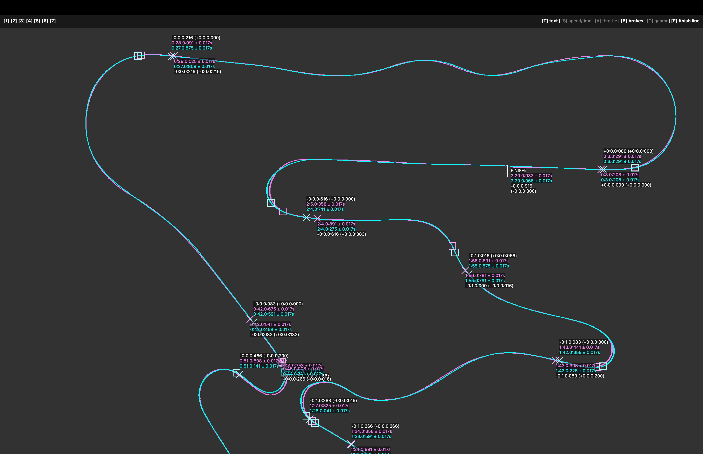
#### Throttle
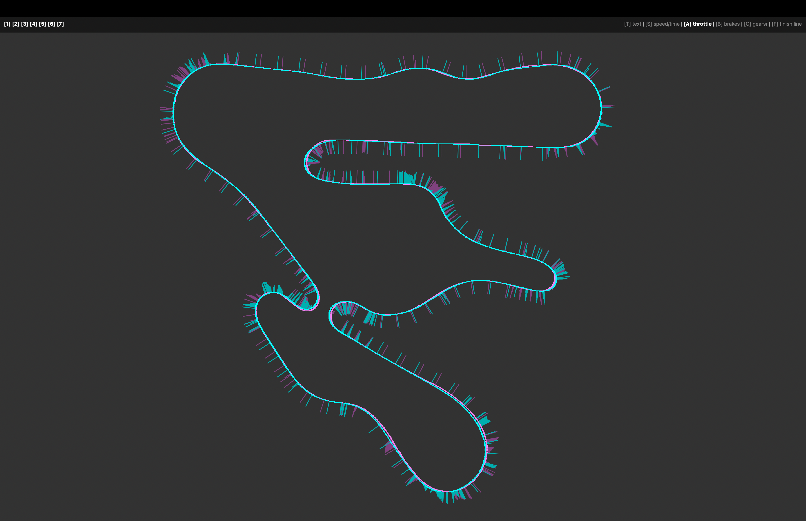
#### Time gains/losses
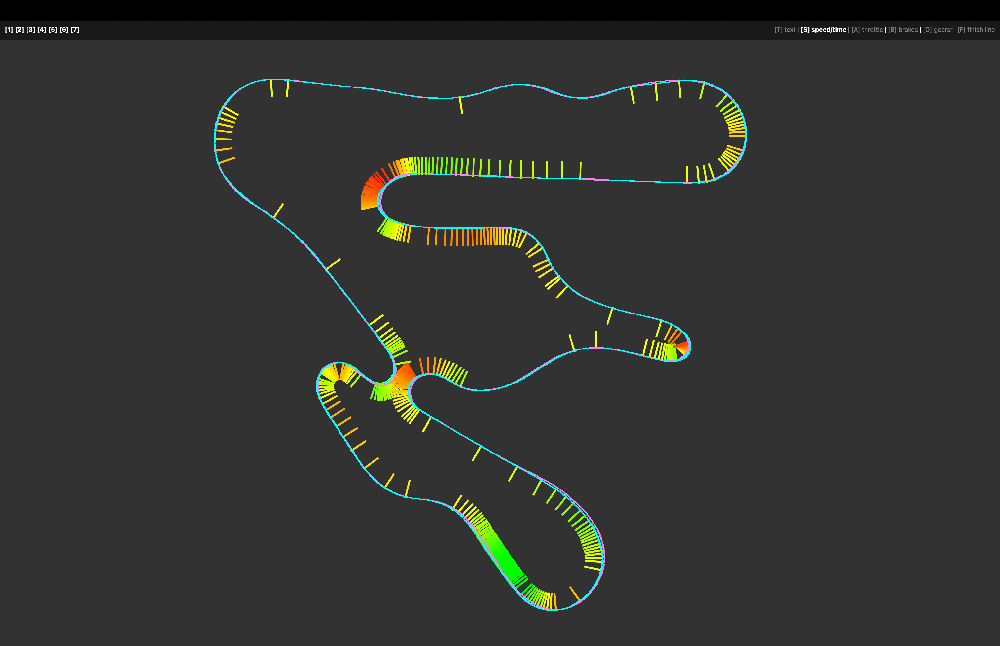
#### Gears
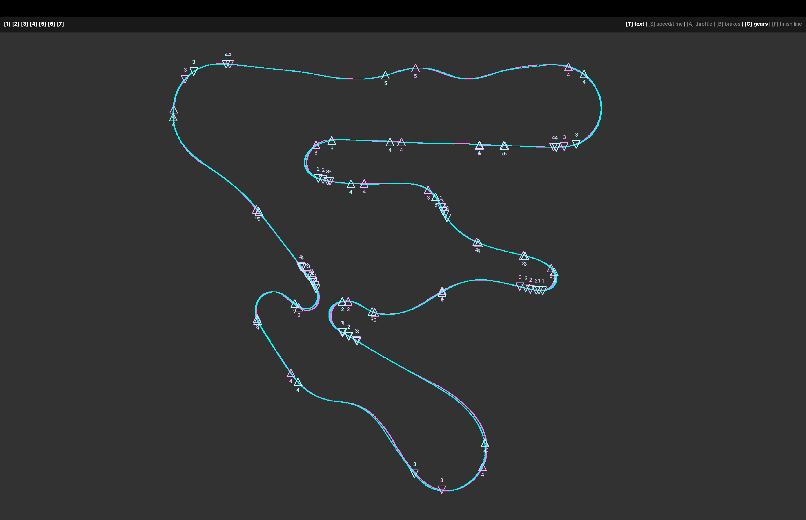
#### Details
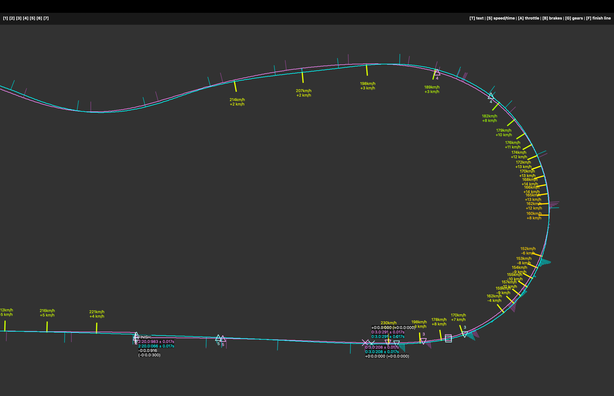
#### Modern art

### gt7toxl/gt7tocsv

Command line tools to export gt7 telemetry data to XLSX or CSV tables.

## License

Licensed under the GNU General Public License Version 3 (see LICENSE file).
